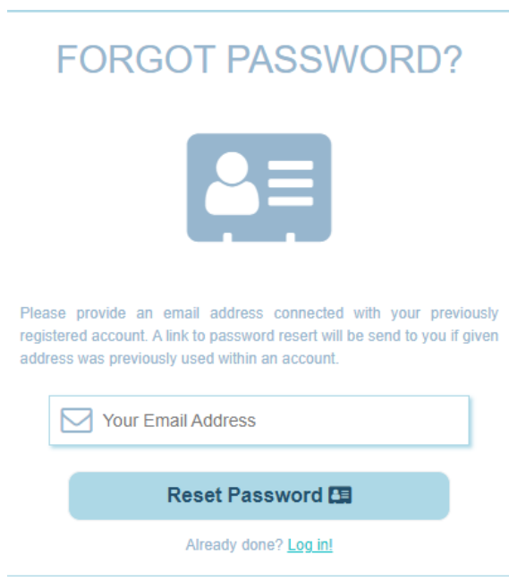

# Artistic Project Manager

### Opis aplikacji

Fragment aplikacji **Artistic Project Manager** stworzonej przy użyciu Vue3, JavaScript, CSS,

Repozytorium zawiera projekt z następującymi elementami:

* Podstawe podstrony: Home, About, 
* Logowanie i rejestracja
* Komunikacja mailowa (potwierdzenie rejestracji, zmiana hasła itp.)
* Prototyp **Panelu Użytkownika**

### Uruchamianie aplikacji

Aby uruchomić aplikację należy w odpowiedniej lokalizacji w wierszu poleceń (lokalizacja folderów **app** i **server**) wpisać następujące komendy:

* app -> ```npm run serve```
* server -> ```npm start```

### Instalacja aplikacji

Jeżeli plik został dopiero pobrany z repozytorium należy wcześniej wykonać polecenie
```npm install```
w wierszu poleceń w odpowiedniej ścieżce (**app** i **server**) przed próbą ich włączenia.

Aby aplikacja i serwer działały poprawnie należy w plikach 
```config.js```
w folderze **app** i **server** zmienić podany adres IP na własne lokalne IP.

### Baza danych

Baza danych tworzona jest automatycznie w momencie rozruchu serwera (jeżeli nie istnieje).
Baza danych znajduje się w folderze **server**.

### Prezentacja aplikacji

* Strona główna aplikacji


* Panele logowania i rejestracji


* Menu przypominania hasła przez adres email



* Panel użytkownika


* Widok mobilny aplikacji


